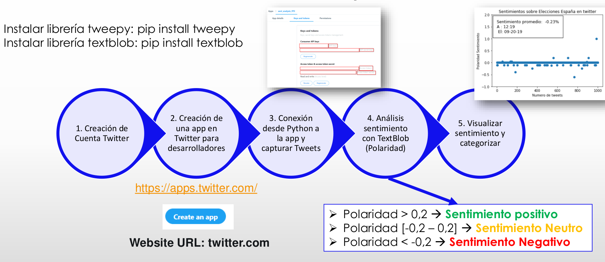
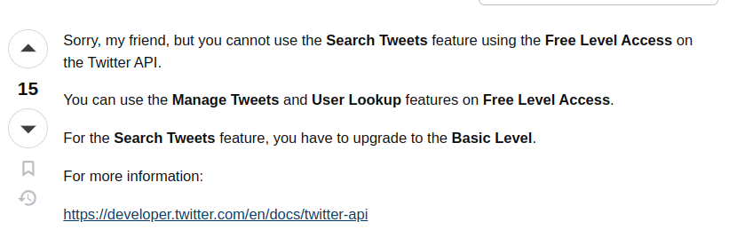

# 2-Analisis-Sentimientos

1. [¿En qué consiste el Análisis de Sentimientos?](#schema1)
2. [Caso Práctico](#schema2)
3. [Ejercicio: Tweets | NLP Cosine Similarity | TF-IDF](#schema3)

<hr>

<a name="schema1"></a>

## 1. ¿En qué consiste el Análisis de Sentimientos?
- Comprender y analizar la respuesta de las personas descubriendo opiniones, emociones y sentimientos sobre un producto, servicio o entidad (mayoritariamente de redes sociales con alto volumen de respuestas).
- Se basa en el Procesamiento del Lenguaje Natural y la estadística asignando valores al texto (positivo, negativo o neutral). Con ello, identificar el sentimiento global (contento, triste,enfadado,…)

- Alta aplicación para:

  - Identificar la respuesta a mensajes de negocio de las empresas
  - Reajuste de la estrategia de negocio
  - Diseñar una mejor experiencia de cliente
  - Mejorar el producto o servicio
  - Análisis de la percepción de marca
  - Predicción de movimientos en bolsa


<hr>

<a name="schema2"></a>

## 2. Caso Práctico


Necesitamos:

```python
pip install tweepy
pip install textblob
```

Con la versión básica del API de tweeter da este error `Forbidden: 403 Forbidden 453 - You currently have access to a subset of Twitter API v2 endpoints and limited v1.1 endpoints (e.g. media post, oauth) only. If you need access to this endpoint, you may need a different access level. You can learn more here: https://developer.twitter.com/en/portal/product.` y es por esto:




Voy a usar este dataset: https://www.kaggle.com/datasets/bhavikjikadara/tweets-dataset


<hr>

<a name="schema3"></a>

## 3. Ejercicio: Tweets | NLP Cosine Similarity | TF-IDF


### **TfidfVectorizer** 

Es una herramienta en Python, específicamente en la librería `scikit-learn`, que se utiliza para convertir una colección de documentos de texto en una matriz de términos y frecuencias de documentos (TF-IDF). **TF-IDF** significa `"Term Frequency-Inverse Document Frequency"` (Frecuencia de Término-Frecuencia Inversa de Documento) y es una medida numérica que indica la importancia de una palabra en relación con un conjunto de documentos.

Aquí hay una breve explicación de lo que hace TfidfVectorizer:

- **Tokenización:** Divide cada documento de texto en palabras individuales o **"tokens"**.
- **Construcción del vocabulario:** Crea un vocabulario de todas las palabras únicas que aparecen en los documentos.
- **Calcula la frecuencia de términos (TF)**: Para cada documento, calcula la frecuencia de cada palabra en ese documento.
- **Calcula la frecuencia inversa de documentos (IDF)**: Calcula la importancia de cada palabra en todo el corpus (conjunto de documentos) considerando cuántos documentos contienen esa palabra. Las palabras comunes que aparecen en muchos documentos tendrán un IDF más bajo, mientras que las palabras menos comunes tendrán un IDF más alto.
- **Calcula TF-IDF**: Multiplica la frecuencia del término (TF) por la frecuencia inversa del documento (IDF) para obtener el peso de cada término en cada documento.


### **CountVectorizer**
Al igual que TfidfVectorizer, es una herramienta proporcionada por la biblioteca scikit-learn de Python que se utiliza para convertir una colección de documentos de texto en una matriz de recuentos de términos. A diferencia de TfidfVectorizer, que utiliza la ponderación TF-IDF para medir la importancia de los términos, **CountVectorizer** simplemente cuenta la frecuencia de ocurrencia de cada término en cada documento.

Aquí está lo que hace CountVectorizer:

- **Tokenización:** Divide cada documento de texto en palabras individuales o "tokens".
- **Construcción del vocabulario:** Crea un vocabulario de todas las palabras únicas que aparecen en los documentos.
- **Calcula la frecuencia de términos (TF):** Para cada documento, cuenta cuántas veces aparece cada palabra en ese documento.
- **Representación de la matriz:** Convierte los documentos de texto en una matriz donde cada fila representa un documento y cada columna representa una palabra del vocabulario. Los valores en la matriz son los recuentos de términos para cada palabra en cada documento.

**CountVectorizer** proporciona una representación simple y directa de la frecuencia de términos en los documentos de texto y es útil para tareas como la clasificación de texto, agrupación de documentos y recuperación de información. Esencialmente, es una forma de convertir datos de texto en un formato numérico que los algoritmos de aprendizaje automático pueden entender y procesar.

### **TfidfVectorizer vs CountVectorizer**

Si bien tanto **TfidfVectorizer** como **CountVectorizer** son herramientas utilizadas para preprocesar datos de texto en Python, tienen algunas diferencias clave en términos de cómo representan la información textual:

- **Ponderación de términos:**
    - **CountVectorizer:** Solo cuenta la frecuencia de ocurrencia de cada término en cada documento. No considera la importancia relativa de los términos en el corpus.
    - **TfidfVectorizer:** Utiliza la ponderación TF-IDF (Frecuencia de Término-Frecuencia Inversa de Documento) para medir la importancia de un término en un documento en relación con el corpus completo. TF-IDF tiene en cuenta tanto la frecuencia de ocurrencia del término en el documento como su rareza en el corpus.
- **Impacto de términos comunes:**
  - **CountVectorizer:** No penaliza los términos comunes que aparecen en muchos documentos. Por lo tanto, los términos muy frecuentes pueden dominar la representación.
  - **TfidfVectorizer:** Penaliza los términos comunes que aparecen en muchos documentos mediante la ponderación IDF. Esto ayuda a reducir el impacto de los términos muy frecuentes y destacar términos más raros y específicos.
- **Uso en diferentes contextos:**
  - **CountVectorizer:** Es útil cuando se quiere simplemente contar la ocurrencia de palabras en un conjunto de documentos, sin tener en cuenta su importancia relativa.
  - **TfidfVectorizer:** Es más adecuado cuando se busca medir la importancia relativa de las palabras en los documentos, especialmente en tareas como la recuperación de información, donde es importante identificar términos clave.

En resumen, **CountVectorizer** es una opción más simple y directa que cuenta la ocurrencia de palabras en documentos, mientras que **TfidfVectorizer** ofrece una representación más sofisticada que considera la importancia relativa de las palabras mediante la ponderación TF-IDF. La elección entre ambas depende del contexto específico de la tarea y de si se desea una representación más básica o más informativa de los datos de texto.


### **cosine_similarity**

La función **cosine_similarity** es una herramienta comúnmente utilizada en Python, específicamente en bibliotecas como scikit-learn, para calcular la similitud coseno entre dos vectores. La similitud coseno es una medida numérica que cuantifica la similitud direccional entre dos vectores en un espacio euclidiano. Es ampliamente utilizada en diversas aplicaciones, incluyendo recuperación de información, clustering, y recomendación, entre otros.
- **Aplicaciones:**
- En procesamiento de lenguaje natural, se utiliza para calcular la similitud entre vectores de representaciones de texto, como el TF-IDF o los embeddings de palabras.
- En sistemas de recomendación, se utiliza para encontrar elementos similares en función de sus características o atributos.
- En clustering, se utiliza para medir la similitud entre diferentes puntos de datos en un espacio de características.

En resumen, **cosine_similarity** es una función que calcula la similitud coseno entre vectores, lo que proporciona una medida numérica de la similitud direccional entre ellos en un espacio euclidiano. Es una herramienta valiosa en una variedad de aplicaciones de aprendizaje automático y análisis de datos.